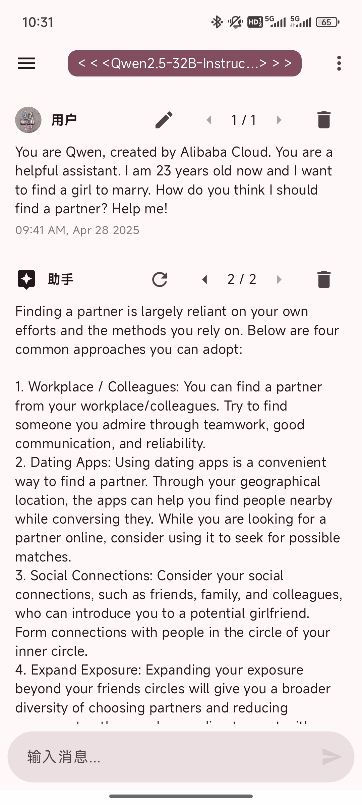
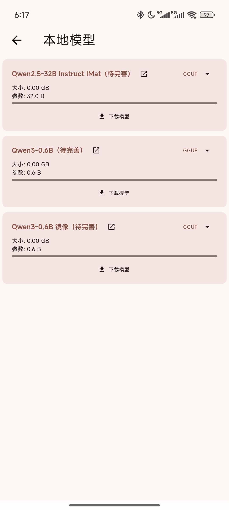
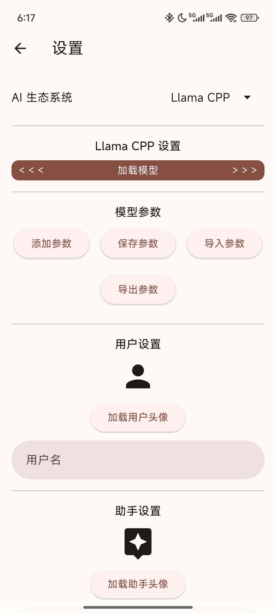
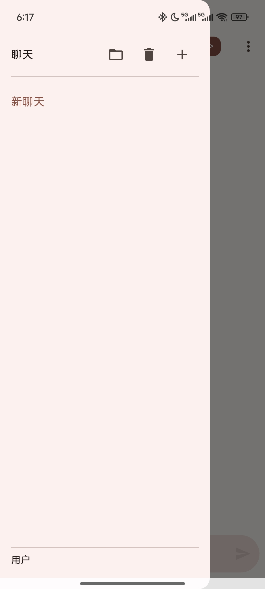

# 32B_SM8650_Chat_Demo

## Abstract

This application demonstrates a chat demo on the SM8650 platform, leveraging local model inference. It features a seamless user experience built with Flutter and powered by the `libllama.so` dynamic library for backend inference. The project provides an APK installer, a demo video, and clear UI screenshots for easy understanding.

## Key Features

This chat demo is designed for intuitive use and powerful local AI capabilities on your device.

### 1. Intuitive User Interface & Local Inference

Our application provides a user-friendly interface developed with Flutter, enabling powerful local model inference directly on your device.

*   **Backend Engine:** Utilizes `libllama.so` for efficient inference.
*   **UI Framework:** Built with Flutter for a smooth, cross-platform experience.
*   **Core Technology:** Supports local model inference, making powerful AI accessible offline.

---

### 2. Effortless Model Management

Easily download and manage your AI models within the app.

*   **Direct Downloads:** Download models directly from various sources (e.g., HuggingFace) to your device.
*   **Source Linking:** Quick access to detailed information on model source platforms.
*   **Streamlined Management:** A dedicated interface for downloading and organizing your models.

---

### 3. Flexible Model Switching & Customization

Switch between different models and fine-tune inference parameters for a personalized experience.

*   **Download & Load:** Seamlessly download and load desired models.
*   **Parameter Customization:** Adjust inference parameters to optimize performance and output.
*   **Personalized Experience:** Tailor the AI's behavior to your needs.

---

### 4. Robust Dialog Management

Create, manage, and import chat histories for organized conversations.

*   **New Dialogs:** Easily start new chat sessions.
*   **History Management:** Quickly delete unnecessary chat records.
*   **Import Functionality:** Import historical dialogue content from external files.
*   **Sidebar Organization:** Chat history is conveniently saved and displayed in the left sidebar.

## Project demo

<!-- Use 'width' and let 'height' adjust automatically -->
<table>
    <tr>
        <td>Main Interface</td>
        <td>Model Download Page</td>
    </tr>
    <tr>
        <td>
            
        </td>
        <td>
            
        </td>
    </tr>
    <tr>
        <td>Model Load Page</td>
        <td>Dialog Management Page</td>
    </tr>
    <tr>
        <td>
            
        </td>
        <td>
            
        </td>
    </tr>
</table>

## Project Resources

*   **[Download APK](assets/32B_SM8650_Chat_Demo.apk)**
*   **[Watch Detailed Demo Video (Issue #1)](https://github.com/BUPTWinsML/32B_SM8650_Chat_Demo/issues/1)**

